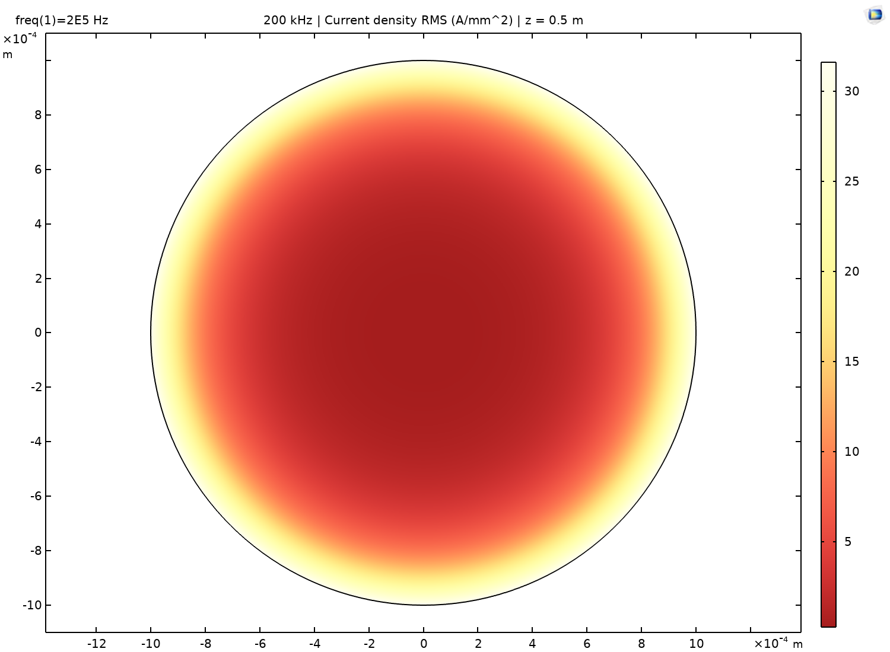
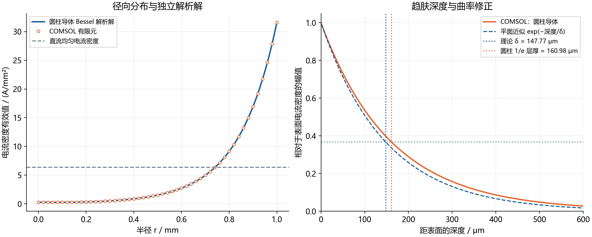
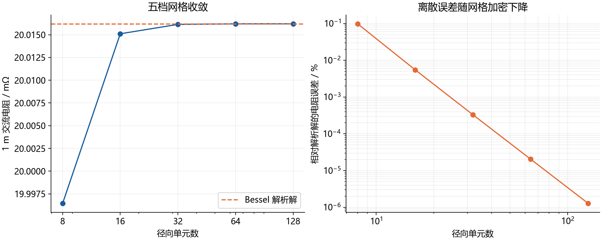
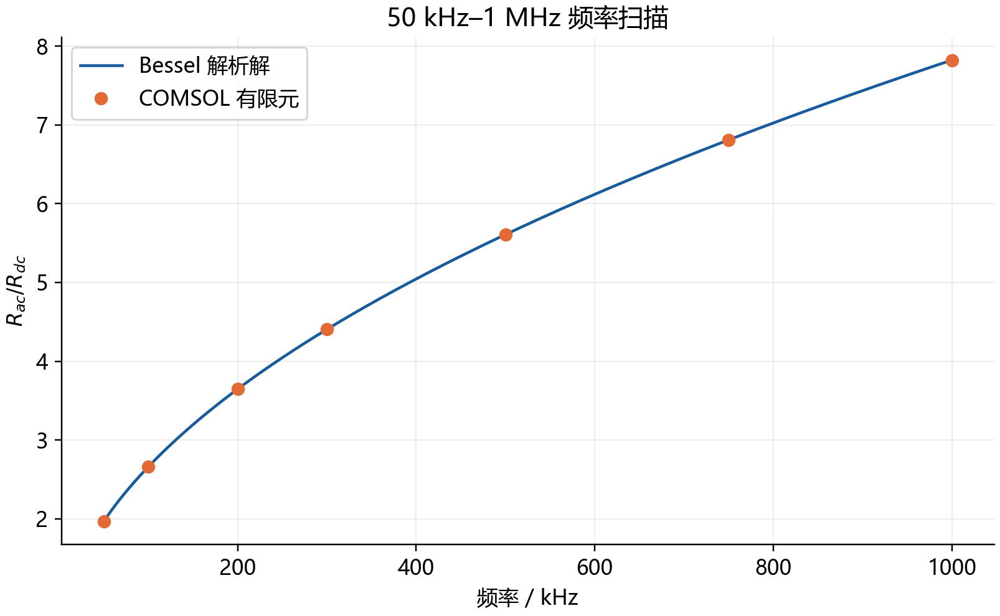

# 第一题：实心铜导线的 COMSOL 高频电磁模型

已在本机 **COMSOL Multiphysics 6.2.0.290** 中完成真实有限元求解。[主工程 Q1_SolidWire_200kHz.mph](Q1_SolidWire_200kHz.mph) 包含几何、铜材料、物理场、网格、频域计算解、截面云图、径向曲线及结果表。需要 COMSOL 和 AC/DC Module 打开及重算。

## 1. 200 kHz 结果

| 量 | 数值 | 获取方式 |
|---|---:|---|
| 理论趋肤深度 δ | 147.771655 μm | 理论公式 |
| 1 m 直流电阻 Rdc | 5.488101486 mΩ | 电导率和几何 |
| 1 m 交流电阻 Rac | 20.016203372 mΩ | COMSOL 损耗积分 |
| Rac/Rdc | 3.647199933 | COMSOL 结果 |
| 每米铜损 | 8.006481349 W/m | COMSOL 结果 |
| 电流积分实部 | 20.000000000000 A RMS | 电流守恒 |
| 电流积分虚部 | 7.262e-16 A RMS | 电流守恒 |
| 表面电流密度有效值 | 31.603756 A/mm² | 有限元结果 |
| 轴心电流密度有效值 | 0.279469 A/mm² | 有限元结果 |

小数位用于复核，不代表材料参数具有同等实验精度。工程上可报告 **Rac = 20.0162 mΩ/m，Rac/Rdc = 3.6472，P = 8.0065 W/m**。

## 2. 参数与假设

半径 a=1 mm，长度 L=1 m；σ=5.8×10⁷ S/m；μ=4π×10⁻⁷ H/m；环境 20 ℃，不考虑温度反馈；f=200 kHz；电流为 **20 A 有效值**。电阻率采用 1/σ=1.724137931×10⁻⁸ Ω·m，避免与附录四舍五入的 1.72×10⁻⁸ 混用。

模型描述孤立长直圆导线的轴对称内部电磁场。完整 1 m 纳入几何；端部施加无径向电流条件，等价于均匀长直导线的一段。忽略接线端子及邻近回流导体导致的端部效应、邻近效应，不计算回路外部电感或温度场。这是针对单根导线趋肤效应的可解析验证基准。

**题目条件冲突：** 2 mm 导线截面为 π mm²，20 A 对应 Jdc=6.3662 A/mm²，超过统一条件的 4 A/mm²。本题保留明确指定的直径和电流。后续若满足 4 A/mm²，至少需要 5 mm² 铜截面，等截面实心线直径约 2.5231 mm，不能直接用本题 2 mm 导线作为该设计的等铜截面对照。

## 3. 理论趋肤深度

采用 exp(jωt) 约定，忽略位移电流，由安培定律、法拉第定律及 J=σE 得到磁扩散方程。半无限平面导体中，切向场随深度 x 呈 exp[−(1+j)x/δ] 衰减，比较系数得到：

$$\delta=\sqrt{\frac{2}{\omega\mu\sigma}}=\sqrt{\frac{1}{\pi f\mu\sigma}}=147.771655\;\mu\mathrm{m}.$$

平面电流振幅每深入 δ 衰减为 1/e。圆导体的曲率修正需用 Bessel 精确解验证。

## 4. COMSOL 模型设置

### 几何、材料、物理场

二维轴对称子午面为 r∈[0,0.001] m、z∈[0,1] m 的矩形，绕 z 轴旋转即直径 2 mm、长度 1 m 的实心圆柱。铜材料电导率为 sigmaCu，相对磁导率为 muCu/mu0_const，以保证使用题目给定 μ；相对介电常数为 1，本 H 公式忽略位移电流。

采用 **Magnetic Field Formulation (mfh)**，求解面外磁场 Hφ，电流在 r–z 平面内。该 Maxwell 方程接口支持频域分析。[COMSOL 6.2 官方说明](https://doc.comsol.com/6.2/doc/com.comsol.help.acdc/acdc_ug_magnetic_fields.08.099.html)

$$\nabla\times\left(\frac1{\sigma}\nabla\times\mathbf H\right)+j\omega\mu\mathbf H=0,\quad \mathbf H=(0,H_\varphi,0),$$

$$J_r=-\frac{\partial H_\varphi}{\partial z},\qquad J_z=\frac{\partial H_\varphi}{\partial r}+\frac{H_\varphi}{r}.$$

### 激励和边界

- 外表面 r=a（边界 4）：Magnetic Field Boundary，H0={0,Ipk/(2*pi*a),0}；Ipk=√2×20 A=28.284271 A，由安培环路定律施加总电流。表面 Hφ 峰值为 4501.5816 A/m。
- 轴线 r=0（边界 1）：Pointwise Constraint，显式施加 Hphi=0。
- 端面 z=0、1 m（边界 2、3）：默认 Magnetic Insulation；在 H 公式中为 n×E=0，此处等价于 Jr=0，允许轴向电流通过端面。
- 仅求解 Hφ，磁散度自然为零，关闭多余散度约束。实际电流方向为轴向，没有用环向线圈代替直导线。

### 长细网格的轴线正则化：重建时必须保留

本安装版本默认的 mfh.curlHz 方程为：

    Hphir + if(abs(r)<0.001*h_spatial, Hphir, Hphi/r)

由于轴向单元很长，h_spatial 会使轴线极限近似扩展到不应近似的径向区域。本工程在 Faraday's Law → Equation View 中使用精确圆柱旋度，仅在轴线上取极限：

    Hphir + if(abs(r)<1e-12[m], Hphir, Hphi/r)

Hφ(0)=0 时，Hφ/r→∂Hφ/∂r，故 Jz(0)=2∂Hφ/∂r。此设置作用于求解方程与后处理，已保存于工程和源文件；**不是用解析解替换仿真结果**。电流积分为 20 A、全径向复数电流与解析解吻合，验证了这一设置。

### 网格、求解和后处理

映射四边形网格，二次形函数。径向依次为 8、16、32、64、128 个单元，轴向为 4 个。最终有 512 个四边形单元、2313 个自由度，径向步长 7.8125 μm，约每个 δ 有 18.9 个单元。解沿 z 均匀，轴向不需要与径向同样细，另用 Nz=8 复算验证。

采用 Frequency Domain，频率 200000 Hz，直接线性求解器 MUMPS。所有标注“有限元”的数值均来自 COMSOL 实际求值。

intV 是子午面 dr dz 积分，以下表达式显式乘一次轴对称 Jacobian 2πr：

    Jrms   = mfh.normJ/sqrt(2)
    qloss  = mfh.normJ^2/(2*sigmaCu)
    Pcu    = intV(2*pi*r*qloss)
    Rac    = Pcu/Irms^2
    Rdc    = L/(sigmaCu*pi*a^2)
    ratio  = Rac/Rdc
    Icheck = intV(2*pi*r*mfh.Jz)/L/sqrt(2)

焦耳热含峰值相量的 1/2 系数；电阻用有效值电流平方归一化。守恒检查积分复数 Jz，不能将不同相位的电流密度幅值直接相加。

截面图使用 Revolve2D → CutPlane(z=L/2)；径向曲线使用 z=L/2、r∈[0,1 mm] 的 CutLine2D。原始 CSV 包含 2001 点，保存电流有效值幅值、复数 Jz 的实部和虚部及损耗密度。

## 5. 网格收敛

| 径向单元数 | 步长 / μm | 四边形单元数 | Rac / mΩ | 相对解析解误差 / % |
|---:|---:|---:|---:|---:|
| 8 | 125.0000 | 32 | 19.996449734 | 0.098689514 |
| 16 | 62.5000 | 64 | 20.015105571 | 0.0054858388 |
| 32 | 31.2500 | 128 | 20.016137436 | 0.00033069222 |
| 64 | 15.6250 | 256 | 20.016199530 | 2.0472846e-05 |
| 128 | 7.8125 | 512 | 20.016203372 | 1.2764727e-06 |

最后两档网格 Rac 相对变化为 **1.9196374e-05%**，最终电阻相对解析解误差为 **1.2764727e-06%**。轴向单元从 4 增为 8 后，电阻变化低于 10⁻⁹%。径向复数 J 的最大绝对误差除以解析表面幅值为 **0.03936%**；局部导数场误差与电阻积分误差不能混同。

粗网格会低估梯度与铜损。8 个径向单元时，步长 125 μm，仅约 1.18 个单元/δ，误差明显高于细网格。最终采用 128 个径向单元，并保留各档已求解工程。上述收敛性只针对本基准模型，不包含材料及实际接线的不确定性。

## 6. 解析验证与趋肤层讨论

令 k=(1−j)/δ，J₀、J₁ 为第一类 Bessel 函数。有效值相量下的精确圆柱解为：

$$J_z(r)=\frac{I_{\rm rms}k}{2\pi a}\frac{J_0(kr)}{J_1(ka)},\quad Z_{\rm int}=\frac{Lk}{2\pi a\sigma}\frac{J_0(ka)}{J_1(ka)},\quad R_{ac}=\operatorname{Re}Z_{\rm int}.$$

解析解仅用于独立验证。

解析电阻为 **20.016203628 mΩ/m**，与有限元吻合。

按 |J(a−t)|/|J(a)|=1/e 定义衰减层厚度：有限元为 **160.9833 μm**，圆柱解析解为 **160.9940 μm**，相差约 0.011 μm。两者比平面 δ=147.7717 μm 大约 8.94%。本题 a/δ≈6.77，曲率仍不可忽略，不能要求圆柱的 1/e 厚度严格等于平面 δ。

## 7. 频率扫描

补充计算 50 kHz–1 MHz，所有频点均为 20 A 有效值，采用最终网格。[Q1_FrequencySweep.mph](Q1_FrequencySweep.mph) 保存全部解。电阻与解析解最大相对误差为 4.30307e-05%。

| f / kHz | δ / μm | Rac / mΩ | Rac/Rdc | 铜损 / W/m |
|---:|---:|---:|---:|---:|
| 50 | 295.543 | 10.789453 | 1.965972 | 4.315781 |
| 100 | 208.981 | 14.607310 | 2.661633 | 5.842924 |
| 200 | 147.772 | 20.016203 | 3.647200 | 8.006481 |
| 300 | 120.655 | 24.176313 | 4.405223 | 9.670525 |
| 500 | 93.459 | 30.780795 | 5.608642 | 12.312318 |
| 750 | 76.309 | 37.370855 | 6.809432 | 14.948342 |
| 1000 | 66.085 | 42.928639 | 7.822129 | 17.171456 |

## 8. 打开与复现

用 COMSOL 6.2 打开主模型，可直接查看已有解：

- Results → Cross section - current density RMS (A/mm^2)：截面云图。
- Results → Radial current density - RMS：径向曲线。
- Results → Full 1 m copper wire (true aspect ratio)：原比例圆柱，长径比大，视觉上细长属于正常情况。
- Results → Tables → Electrical results (RMS convention)：电阻、损耗及电流积分。
- Results → Tables → Mesh convergence：五档网格数值表。
- Global Definitions → Parameters：尺寸、电流、频率、材料、Nr 与 Nz。修改后重建网格，再计算 Study 1；改变尺寸时也需同步调整切线/截面坐标。

source/Q1SolidWire.java 从零建模、逐级网格求解并导出数据；source/Q1Post.java 负责后处理、轴向核对及扫频；Q1_SolidWire_generated.java 为 COMSOL 自身导出的主模型源码。

当前机器可运行 source/Rebuild.ps1 重建，运行会覆盖同名仿真产物。源文件 OUT 为本次输出目录，迁移时需修改。构建脚本将临时配置放入工作目录，不修改全局 COMSOL 首选项。

source/analyze_q1.py 读取有限元 CSV，以 NumPy/SciPy 计算独立解析解，以 Matplotlib 制图；此步骤不承担有限元求解。

| 文件 | 内容 |
|---|---|
| Q1_SolidWire_200kHz.mph | 主模型与 200 kHz 解 |
| q1_mesh_8.mph 至 q1_mesh_128.mph | 各档网格的独立解 |
| q1_axial_check_Nz8.mph | 轴向网格核对 |
| Q1_FrequencySweep.mph | 7 个频点的解 |
| mesh_convergence.csv | 网格原始结果 |
| radial_200kHz.csv | 径向复数电流和损耗原始数据 |
| frequency_sweep.csv | 扫频原始结果 |
| radial_theory_comparison.csv、frequency_theory_comparison.csv | 有限元与解析解对照 |
| results_summary.json | 关键数值与验证指标 |
| comsol_cross_section.png、comsol_radial_curve.png | COMSOL 原生导出图 |
| cross_section_FEM.png | 径向有限元数据按轴对称重建的排版图 |
| logs 文件夹 | 最终成功求解及图像导出日志 |

## 9. AI 与工具使用记录

本次使用 Codex 协助读取赛题、构建 COMSOL Java 模型、检查边界条件及方程视图、执行有限元计算、编制解析验证与说明。有限元数据来自本机 COMSOL 6.2 实际求解；NumPy/SciPy 用于独立验证，Matplotlib 用于整理结果图。比赛提交时，应将本条并入队伍实际使用的完整 AI 工具声明。
