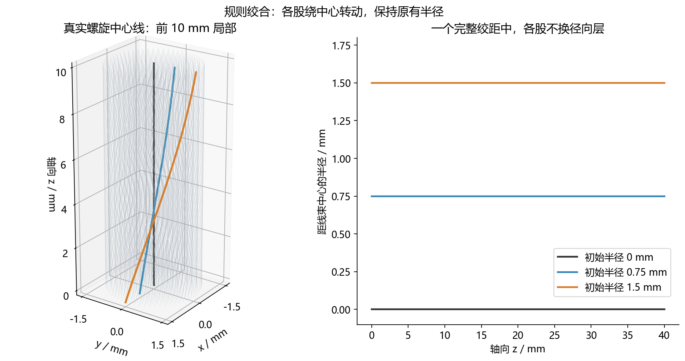
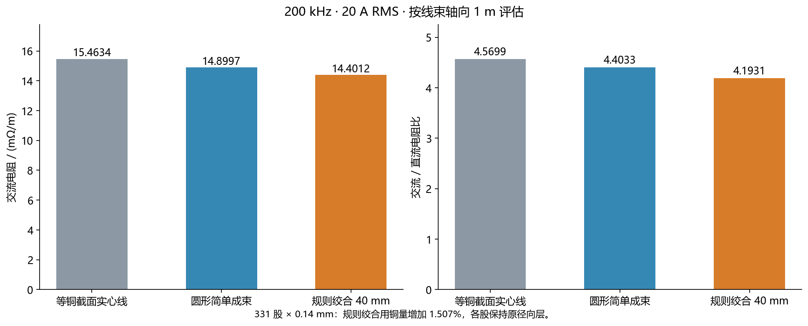
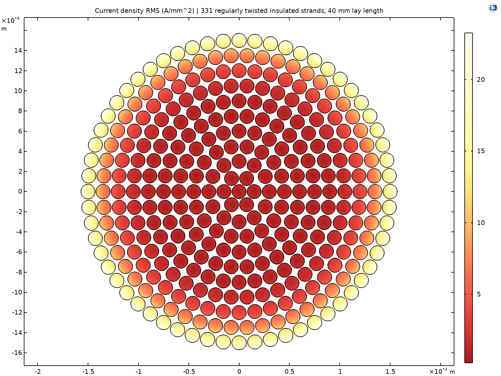
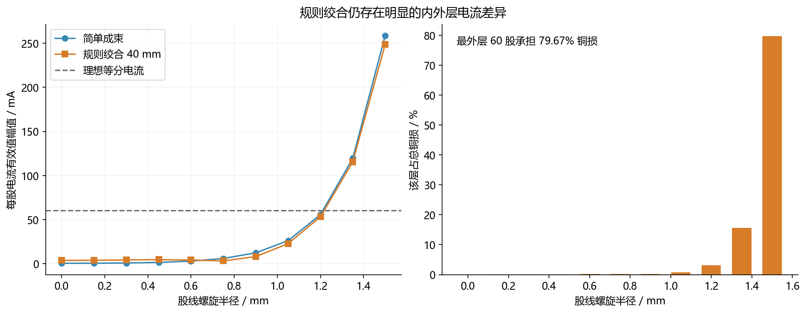

# 第二题：规则绞合 Litz 线的 COMSOL 仿真

本次沿用前一版圆形简单成束的 **331 股、单股铜丝直径 0.14 mm、20 A RMS、200 kHz、20 °C**，增加 **40 mm 绞距**。各股彼此绝缘，同旋向绕线束轴转动，始终保持原来的径向层。

计算结果为 **交流电阻 14.401182 mΩ/m，交流/直流电阻比 4.193102，铜损 5.760473 W/m**。“每米”指线束的轴向长度。

## 1. 文件用途

| 文件 | 内容 |
|---|---|
| Q2_RegularTwist_200kHz.mph | 已完成求解的正式电磁模型，含电流密度、铜损云图和数值结果 |
| Q2_RegularTwist3D_OnePitch.mph | 331 根真实螺旋铜丝的三维几何，一个 40 mm 绞距，供旋转查看结构 |
| regular_twist_200kHz_results.csv | 正式工况的原始 COMSOL 导出结果 |
| strand_currents_200kHz.csv | 每股复数电流、面积和铜损 |
| verification/ | 网格、边界、低频、零绞度及模型回读校验 |
| source/ | 可独立重建模型的源文件与重建脚本 |

电磁计算采用**螺旋坐标变换后的二维三分量求解**，保留周向电流、真实线长及磁场耦合，利用结构的螺旋对称性计算均匀周期线束的内部行为。三维文件仅含几何，本次没有对整根 1 m 导体进行完整三维有限元电磁求解。

## 2. 几何与材料参数

| 参数 | 数值 |
|---|---:|
| 铜电导率 / 相对磁导率 | 5.8×10⁷ S/m / 1 |
| 频率 / 总电流 | 200 kHz / 20 A RMS |
| 股数 / 单股正常截面直径 | 331 / 0.14 mm |
| 排列 | 中心 1 股；第 k 层 6k 股，k=1…10 |
| 各层半径 | 0.15k mm |
| 绞距 / 每轴向米圈数 | 40 mm / 25 圈 |
| 最大螺旋角 | 13.258181° |
| 最外层每轴向米的实际线长 | 1.027383339 m |
| 正常截面铜面积总和 | 5.095349125 mm² |
| 水平截面铜面积，解析值 | 5.172136587 mm² |
| 最小实际铜丝间隙 | 9.968777 μm |
| 主模型空气圆半径 | 20 mm |
| 丝间及空气电导率 | **0 S/m** |

200 kHz 时趋肤深度约 147.772 μm，丝径与趋肤深度之比约 0.947。名义直流电流密度为 3.925148 A/mm²。计入各层实际线长后，10 Hz 校验中的最大电流密度约 **3.984037 A/mm²**，仍小于 4 A/mm²。

与直线成束相比，每轴向米的铜体积由 5.095349 cm³ 增至 5.172137 cm³，**增加 1.507011%**。以下对比采用相同股数与正常丝径，不是相同每轴向米铜质量的对比。

## 3. 正式结果与对照

| 结构 | Rdc / mΩ/m | Rac / mΩ/m | Rac/Rdc | 铜损 / W/m |
|---|---:|---:|---:|---:|
| 等名义铜截面实心圆线，直径约 2.547077 mm | 3.383748 | 15.463402 | 4.569903 | 6.185361 |
| 圆形简单成束 | 3.383748 | 14.899678 | 4.403305 | 5.959871 |
| 本次规则绞合，绞距 40 mm | 3.434493 | 14.401182 | 4.193102 | 5.760473 |

相对于简单成束，交流电阻与铜损降低 **3.3457%**；相对于上述实心导体，降低 **6.8693%**。规则绞合改变了线长和电磁耦合，但未实现内外层换位。不能据一个绞距的结果断言已经找到最优方案。

实心导体对照使用总铜面积 5.095349 mm² 的已有仿真；第一题原始直径 2 mm 的导体面积不同，未直接混入此表。对照数据副本与来源校验值保存在 references/。

## 4. 电流分布

| 指标 | 本次结果 |
|---|---:|
| 理想等分电流 | 60.422961 mA RMS/股 |
| 中心股电流幅值 | 3.683942 mA RMS |
| 最外层每股平均电流幅值 | 248.495400 mA RMS |
| 最外层电流幅值范围 | 248.442476–248.548443 mA RMS/股 |
| 最外层 60 股承担的铜损 | 79.670429% |
| 截面最大实际电流密度 | 23.249635 A/mm² RMS |

仍有明显的内外层不均流。各股电流具有不同相位，必须复数相加；全部股电流的复数和为约 20+j0 A RMS，幅值之和一般不等于 20 A。云图显示转换回真实空间后的电流密度模长有效值，包含三个方向的分量。

## 5. 数值校验

| 校验 | 结果 |
|---|---|
| 网格 | 铜丝最大单元尺寸 46.667、28、17.5 μm；后两档 Rac 相差 0.000288% |
| 主模型自由度 | 660587，二次磁矢势有限元 |
| 外边界 | 空气半径由 20 mm 增至 40 mm，Rac 改变 0.021255% |
| 零绞度极限 | 绞率为 0 时，与原直线模型 Rac 相差 0.00006726% |
| 低频极限 | 10 Hz 时 Rac/Rdc=1.000006553，符合螺旋线长公式 |
| 功率平衡 | 主模型铜损与端口实功率相对误差 1.725e-11 |
| 股电流与铜损 | 331 股复数电流之和为 20 A；逐股铜损之和与总体积分一致 |
| 求解器 | GMRES、MUMPS 预条件，相对容差 10⁻⁵，保持丝间零电导率 |
| 文件回读 | COMSOL 重新打开正式和低频 MPH，重新提取结果并通过核对 |

结果宜报告为 **Rac≈14.40 mΩ/m、Rac/Rdc≈4.193、Pcu≈5.76 W/m**。原始表保留更多位数用于复核，不代表实验精度。

verification/regularized_*.csv 与 regularization_0p01.csv 是辅助稳定化交叉校核记录；**正式模型以及正式网格、边界和低频校验均采用 0 S/m**。

## 6. 假设与复现

各股两端等效并联，施加共同的轴向复电压梯度，让各股电流自然分配，没有强制均流。端部接头、有限长度端部场、外部回流导体、显著电容效应和温度反馈未纳入。电感/电压虚部依赖所取的外部场参考，不直接代表实际回路的测量值。

螺旋对称降维适用于本次同旋向、同绞距、固定半径的结构。径向换位、不同绞距或多级子束需要重新核查其适用性。

1. 打开正式电磁 MPH，在“结果”中查看电流密度、铜损绘图组及数值表。
2. 打开三维几何 MPH，旋转查看一个完整的 40 mm 周期。
3. source/Rebuild.ps1 调用 COMSOL 6.2，在新目录独立重建电磁模型、校验模型和三维几何。通过试算复电流调整激励，再求解到指定的总电流。
4. 正式 MPH 保存当前工况下已标定的电压梯度。修改频率或几何后，保持 20 A 需要重新标定；仅修改电流参数不会自动改变已有电压激励。
5. source/analyze_results.py 复核导出数据并生成图表；source/check_geometry.py 复核最小三维间隙、线长与直流电阻。

计算软件：COMSOL Multiphysics 6.2.0.290。上述数据已实际求解并保存；Codex 辅助完成参数化建模、校验和说明。

## 附录：螺旋坐标公式

令 α=2π/P，第 k 层第 j 股的中心线为

$$
\mathbf c_{kj}(z)=
[r_k\cos(\theta_{kj}+\alpha z),\
r_k\sin(\theta_{kj}+\alpha z),\
z],\qquad
r_k=0.15k\ {\rm mm},\quad
\theta_{kj}=2\pi j/(6k).
$$

中心股另取 r=0。长度因子、细长导线近似直流电阻为

$$
s_i=\sqrt{1+(\alpha r_i)^2},\qquad
R_{\rm dc}=\frac{L}{\sigma A_0\sum_i 1/s_i},
\qquad A_0=\pi d^2/4.
$$

铜丝圆截面垂直于自己的中心线，求解截面使用圆管与水平面的真实交线。取 a=d/2、h=αρ、s=√(1+h²)，可参数化为

$$
\Theta(t)=\theta_0+\alpha a\,h\,\sin(t)/s,
\quad
x=(\rho+a\cos t)\cos\Theta-(a/s)\sin t\sin\Theta,
\quad
y=(\rho+a\cos t)\sin\Theta+(a/s)\sin t\cos\Theta.
$$

在参考截面 z=0，映射 Jacobian 与材料变换为

$$
F=\begin{bmatrix}
1&0&-\alpha y\\0&1&\alpha x\\0&0&1
\end{bmatrix},\quad
K=F^{-1}F^{-T}=
\begin{bmatrix}
1+\alpha^2y^2&-\alpha^2xy&\alpha y\\
-\alpha^2xy&1+\alpha^2x^2&-\alpha x\\
\alpha y&-\alpha x&1
\end{bmatrix}.
$$

铜中取 σ′=σK，所有区域取 μ′=μK，绝缘区 σ′=0，求解 Ax、Ay、Az 三个分量。公共电压梯度 E₀ 对应铜内源电流

$$
\mathbf J'_{\rm src}=\sigma E_0[\alpha y,-\alpha x,1]^T.
$$

源电流和感应电流共同构成总电流，不将上式单独作为预先指定的股线电流。由变换空间的总电流 J′ 恢复真实空间电流：

$$
\mathbf J=F\mathbf J'
=[J'_x-\alpha yJ'_z,\
J'_y+\alpha xJ'_z,\
J'_z]^T.
$$

COMSOL 频域场采用峰值复幅值，故

$$
I_{\rm rms}=\frac1{\sqrt2}\int_{\Omega_{\rm Cu}}J'_z\,dA,\qquad
P_{\rm Cu}=\frac{L}{2\sigma}\int_{\Omega_{\rm Cu}}|\mathbf J|^2\,dA,
\qquad R_{\rm ac}=P_{\rm Cu}/|I_{\rm rms}|^2.
$$

以上为螺旋对称的磁准静态处理。微小介电项沿用磁场接口默认值，在所用铜电导率与频率下对所报告的铜损可忽略。

方法参考：[Finite Element Modeling of Power Cables using Coordinate Transformations](https://arxiv.org/abs/2307.00814)，[COMSOL 三分量磁场设置](https://doc.comsol.com/6.2/doc/com.comsol.help.acdc/acdc_ug_magnetic_fields.08.027.html)，[COMSOL 磁矢势规范与迭代求解说明](https://www.comsol.com/blogs/how-do-i-use-gauge-fixing-in-comsol-multiphysics/)。
