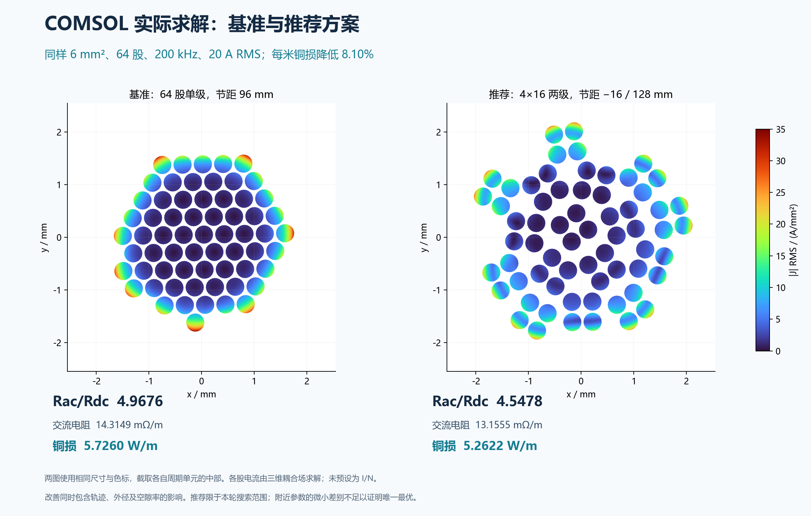
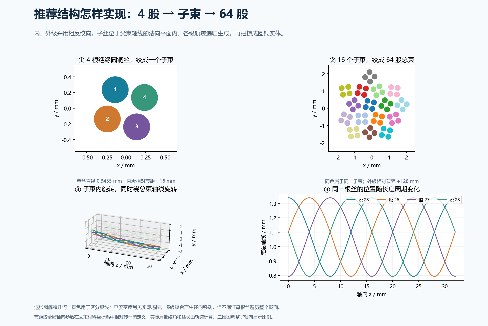
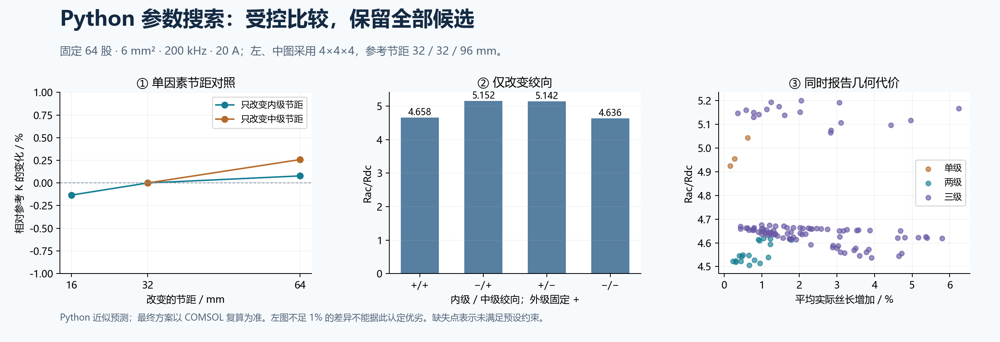

# 问题三：结果与控制变量简报

更新：2026-09-27。研究范围为传统多级递归绞合；本报告续接指定工作目录中的问题三研究。数值来自保留的 COMSOL 原始输出与 Python 计算记录。

已完成“冻结初始 COMSOL 基准 → Python 参数筛选 → 候选 COMSOL 复算 → 数值检查”。本轮推荐 **4×16 两级绞合、内级 −16 mm、外级 +128 mm**。相对于单级基准，每米铜损降低 **8.10%**，Rac/Rdc 降低 **8.45%**。这是给定范围内经复算的推荐方案，尚不能证明是唯一或全局最优。

## 1. 初始参数为什么这样选

铜面积固定为 6 mm²，20 A 对应名义平均直流电流密度 3.333 A/mm²，低于题目 4 A/mm² 上限。固定 64 股，则单丝直径由面积决定为 0.345494 mm；在 200 kHz 下趋肤深度约 0.148 mm，孤立单丝解析 Rac/Rdc 约 1.0377。这个丝径可用作结构优化的起点，但不是丝径最优值。

64 股可构成单级 64、两级 4×16 和三级 4×4×4，便于在同一股数、丝径和铜面积下研究分组影响。初始单级节距 96 mm，实际平均丝长增长约 0.2804%，最大绞角约 6.07°，几何较温和。名义间距统一为 40 μm，各股保持电绝缘。

统一工况：200 kHz、20 A RMS、20°C、铜电导率 5.8×10⁷ S/m、相对磁导率 1。面积指各单丝法向铜截面之和，电阻与损耗按轴向每米计算，计入实际丝长增长。

## 2. 三维 COMSOL 的直接对比

| 项目 | 冻结基准：单级 64 | 推荐：两级 4×16 |
|---|---:|---:|
| 内→外相对节距 / mm | 96 | −16 / +128 |
| Rdc，10 Hz 直流极限 / mΩ·m⁻¹ | 2.881684 | 2.892727 |
| Rac，200 kHz / mΩ·m⁻¹ | 14.314943 | 13.155524 |
| Rac/Rdc | 4.967561 | 4.547793 |
| 20 A 铜损 / W·m⁻¹ | 5.725977 | 5.262210 |
| 外径保守上界 / mm | 3.5945 | 4.5308 |
| 实际平均丝长增长 | 0.2804% | 0.6649% |
| 最大局部绞角 | 6.065° | 10.436° |
| 最大复数均流偏差 | 403.54% | 163.61% |

复数均流偏差定义为 max|Iⱼ−I总/N| / |I总/N|，同时考虑幅值与相位；它可以超过 100%。Iⱼ 为每股轴向体积平均净电流，未预设 I/N。

两种正式结果都来自实际三维圆铜实体的耦合电磁场。推荐方案外径约增加 26.0%，因此降低损耗是轨迹、分组及空隙率共同改变的结果，不能全部归因于换位。

第三类三级 4×4×4 也已实际复算：−32/−16/+64 mm 的初算 K=4.79141、铜损 5.72715 W/m，未优于推荐两级方案。此三层结果采用筛选网格，尚未通过与最终推荐相同的全套收敛检查，不用于论证其相对基准的微小差别。

## 3. Python 控制了什么变量

| 变量类别 | 本轮具体处理 |
|---|---|
| 固定工况 | 铜面积 6 mm²、频率 200 kHz、总电流 20 A RMS、材料、温度、绝缘条件 |
| 固定几何条件 | N=64、由面积推得 d=0.345494 mm、名义间距 40 μm |
| 主动优化变量 | 单级 64 / 两级 4×16 / 三级 4×4×4；各级节距；内、中级相对正反绞向 |
| 节距范围 | 内、中级绝对值 16 / 32 / 64 mm；外级 64 / 96 / 128 mm |
| 固定构造规则 | 各分组采用规则圆环或紧凑六角位置，初相位规则不变；不逐丝自由移动 |
| 联动变量 | 绞角、真实丝长、外径、铜体积、实际间隙、弯曲半径，由三维轨迹计算 |
| 目标 | 首要最小化 Rac/Rdc，同时要求 Rac 和 20 A 铜损不劣于基准；记录均流偏差 |
| 数值控制 | 同一材料和场方程、验证旋转周期映射；网格、空气范围、单元长度分别单独改变 |

共预定义 129 组离散参数，逐组枚举，无随机寻优或人为节距惩罚。其中 10 组不满足几何条件，19 组预测铜损高于基准，100 组进入可行筛选集。129 组记录属于 Python 筛选，并非 129 次三维有限元求解；四组入围候选另作 COMSOL 复算。完整记录包含被排除的方案及原因。

变量控制实验包括：① 固定结构和其余节距，只改一个节距；② 固定节距绝对值，只改绞向；③ 固定股数、铜面积、频率和激励，比较三种分组；④ 固定同一几何分别检查数值网格、空气范围和轴向长度。结构变化仍会联动外径，报告中保留此混合影响。

下表补充推荐结构附近的单因素变化。固定 4×16 分组，前三行只改变外级节距；后三行固定外级 128 mm，只改变内级节距绝对值。表中 K 为 Python 近似预测：

| 内 / 外相对节距 / mm | Python K | 平均丝长增长 |
|---|---:|---:|
| -16 / +64 | 4.59483 | 1.2284% |
| -16 / +96 | 4.52802 | 0.8008% |
| -16 / +128 | 4.50517 | 0.6649% |
| -32 / +128 | 4.51848 | 0.3084% |
| -64 / +128 | 4.52234 | 0.2369% |

在本组离散点上，增大外级节距使预测 K 降低、实际丝长缩短；内级绝对节距从 16 增至 64 mm 时，预测 K 略升而丝长缩短。后一差别远小于模型的独立验证误差，不能据此精确确定连续最优节距。K 最小与 Rac 最小也不必对应同一点，因为不同几何的 Rdc 会变化。

## 4. 模型考虑范围与边界

已纳入集肤效应、邻近效应、股间磁耦合、三维倾斜与弯曲轨迹、实际丝长以及自由电流分配。Python 使用圆柱响应和多极耦合的物理近似模型，包含横向及轴向磁场引起的损耗；COMSOL 使用完整 A–φ 场求解。两者均不指定各股电流相等。

几何筛选统一设定：外径≤6 mm、平均丝长增长≤10%、最大绞角≤30°、最小弯曲半径≥10d、保守三维股间隙≥10 μm。这些是本研究明确声明的工程假设，不是赛题或制造标准给定的限值。

**股数与联动丝径可以扩展研究，但本轮没有优化它们。** 也没有进行 50 kHz–1 MHz 扫频、温升反馈、介质损耗与分布电容、实际端部接头和引线、制造成本、绝缘老化或机械疲劳分析。弯曲半径合格只代表几何筛选通过。

本轮是传统多级递归绞合的三类结构对比。多级轨迹有径向移动，但不能保证每根丝遍历整个截面，更没有证明问题四的“完美换位”。

推荐几何的保守股间隙下界为 38.926 μm，最小弯曲半径约 27.838 mm。该间隙证据适用于周期样条中心线，包含相邻周期副本；不等同于绝缘公差或 CAD 误差的认证。

## 5. 验证结果与不确定性

基准先完成网格、空气范围、单元长度检查并冻结，之后才开始参数优化。推荐方案首次将铜内最大单元尺寸从 a/2 减小至 a/3，Rac 变化 −1.0063%，略超原定 1% 门槛，因而继续减小至 a/3.25。这个再次加密将最大横向单元尺寸再减小 7.69%，其余网格和几何参数不变，受本机内存约束选取。下表网格检查比较 a/3 与 a/3.25；长度、空气检查各自以同一 a/2 初始网格为对照。原先未达标的记录完整保留。

| 推荐方案数值检查 | Rac 变化 |
|---|---:|
| mesh_divisor_3_to_3.25 | -0.1445% |
| cell_length_4_to_8_mm_same_mesh_settings | +0.0554% |
| air_radius_6_to_10_mm_same_mesh_settings | -0.0479% |

预先规定的判据为每项 Rac 变化<1%、实功率与铜损差异<0.1%、直流丝长公式差异<0.5%。推荐最终模型功率差异为 0.00600%，直流参考差异为 +0.00216%，各股体积平均电流向量的网格变化为 0.0436%。这些检查支持整体电阻、损耗对比，不是严格的误差上界。

从最初 a/2 到最终 a/3.25，Rac 累计变化为 -1.1493%。最后一次网格尺寸只缩小 7.69%，故“相邻网格变化小于 1%”不能解释为真实离散误差必然小于 1%；本次也未用 Richardson 外推建立严格误差区间。

原始梯度端面电流仍有 3.164% 的局部不平衡，不能将整体电阻的收敛精度套用到端面梯度或热点点值。另外导出了约束反力通量；同股端面不平衡为平均股电流幅值的 5.4981e-09%，旋转周期配对不平衡 1.3938e-08%。详见原始 REACTION 数据，符号按边界反力约定。

Python 初始三组独立三维验证中，Rac 最大偏差 4.47%，排序一致。筛选后又复算了下表四组候选；误差定义为 Python/COMSOL−1，均采用同一初算网格档位：

| 候选编号 | COMSOL K | COMSOL 铜损 / W·m⁻¹ | Python Rac 偏差 |
|---|---:|---:|---:|
| g4x16_pm16_128 | 4.60005 | 5.32339 | -2.08% |
| g4x16_p16_128 | 4.60779 | 5.34742 | -2.05% |
| g4x16_pm32_128 | 4.65757 | 5.37116 | -3.01% |
| g4x4x4_pm32_m16_64 | 4.79141 | 5.72715 | -5.35% |

新的三级候选 Rac 偏差绝对值为 5.352%，超过原定 5% 目标，说明近似模型对该结构的预测仍有局限。此比较使用筛选网格，误差同时包含 ROM 近似与有限元离散因素，不能将偏差全部归因于某一个物理项；本次没有调系数掩盖误差。推荐候选已经独立进行了更细网格 COMSOL 确认，但不能因此保证未复算的所有候选排名无误。新增限制写入 `data/rom_post_confirmation.json`：历史筛选记录保留，继续生成新预测前需重新验证模型。

推荐的内级 16 mm、外级 128 mm 都碰到本轮搜索边界。反绞向邻近方案的 K 差距约 0.17%，低于当前数值精度所能可靠区分的幅度。因此报告“约 8.1% 的已验证结构改进与一组推荐参数”，不报告唯一或连续全局最优。

## 6. 文件与复现

- [基准 COMSOL 模型](data/raw/baseline_64_av_m3/model_fem.mph)
- [推荐 COMSOL 模型](data/raw/recommended_m325/model_fem.mph)
- [实际三维场图](figures/final_3d_field.png)
- [完整 129 组搜索表](parameter_search.csv)
- [最终数值与校验记录](final_results.json)
- [Python 参数搜索](src/optimize_design.py)、[物理近似模型](src/multipole_rom.py)、[三维几何](src/recursive_geometry.py)
- [COMSOL 建模与最终检查](src/verify_recommended.py)、[场方程说明](MODEL_METHOD.md)、[搜索范围](DESIGN_SPACE.md)
- [本次补充加密脚本](src/refine_recommended.py)、[求解器调用与资源监测](src/run_java.py)

`data/raw/` 各案例保留输入参数、Java 建模源、COMSOL 模型、原始输出、运行和资源日志，失败试算也保留并明确排除。最终模型 SHA-256 与源程序摘要写入 `final_results.json`；基准先验冻结记录在 `baseline_frozen.json`。

本机使用 COMSOL 6.2 和 Python（NumPy、SciPy、Matplotlib、psutil、threadpoolctl）。COMSOL 批处理工具位于 `D:/tools/comosol/COMSOL62/Multiphysics/bin/win64`；科学计算 Python 位于 `D:/tools/anaconda/python.exe`。COMSOL 可以直接打开上述 MPH 查看几何、场和求解设置。

在本目录下依次运行 `python src/finalize_study.py`、`python src/write_report.py` 可从已有原始解重新生成汇总、场图和 Markdown 报告，无需重新求解。`python src/build_report_pdf.py` 生成便于阅读的 PDF，需要 ReportLab 和本机微软雅黑字体；若科学计算 Python 未安装 ReportLab，可使用本机 Codex 随附的文档 Python。`python src/audit_delivery.py` 核对最终数字、源程序摘要、采样及文件链接。`python src/optimize_design.py` 可读取已有 129 组匹配记录重建筛选表；新建预测受追加验证状态限制。COMSOL 新建试算须采用新的案例名称，以免覆盖证据。

推荐案例 `recommended_m325` 的完整输入、Java 源文件、MPH、场采样和日志均保留在对应 `data/raw/` 目录。求解线程上限 4；资源监测只保护本次计算，不关闭其他程序。此前 `baseline_64_av_m3` 基准保持冻结。

本次续作由 Codex（当前会话基于 GPT-6）辅助完成赛题阅读、遗留资料审查、计算续跑、证据核验、程序修订及报告与图表整理。数值来自实际运行的 COMSOL 与 Python。历史工作目录未完整保存此前各轮 AI 模型标识，故不臆造历史版本；最终整套赛题提交时仍需合并队伍的完整 AI 使用记录。

## 7. 与整套赛题的关系

本目录交付的是问题三既定范围的续作结果：三类传统结构、受控参数筛选、候选复算、敏感性分析和可复查证据。它没有新增问题一规定的 2 mm 实心线算例，也没有补写问题二完整设计论证；问题四的完美换位判据、新拓扑验证和公开网站亦未在本次研究中完成。因此本报告是可纳入总论文的问题三证据与章节材料，不代表四题全部完成。

后续若追求更强优化结论，应另立扩大节距范围、变化股数与丝径、固定外径或填充率的控制研究，并先补充 ROM 在新区域的三维验证。当前参数位于搜索边界，不能据本轮结果推断更细股数或其他编织拓扑无改进空间。
